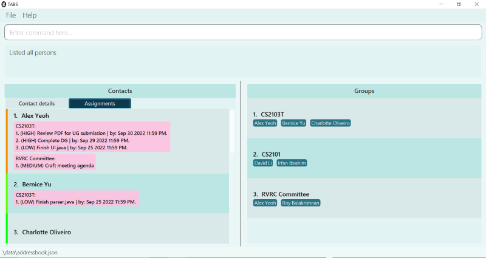

TABS is a project centric desktop application specially designed to manage contacts, groups and tasks within members of the group.

TABS's target users are student project team leaders who are facing issues with **group management** and **task allocation**.

TABS aims to help project team leaders by
1. Simplifying the **group management** process.
2. Providing an **overview** of tasks assigned to members.

It is targeted at individuals with less programming background i.e. **less CLI-intensive** in nature.

* If you are interested in using TABS, head over to the [_Quick Start_ section of the **User Guide**](https://ay2223s1-cs2103t-w10-1.github.io/tp/UserGuide.html).
* If you are interested about developing TABS, the [**Developer Guide**](https://ay2223s1-cs2103t-w10-1.github.io/tp/DeveloperGuide.html) is a good place to start.

**Acknowledgements**

* Libraries used: [JavaFX](https://openjfx.io/), [Jackson](https://github.com/FasterXML/jackson), [JUnit5](https://github.com/junit-team/junit5)
